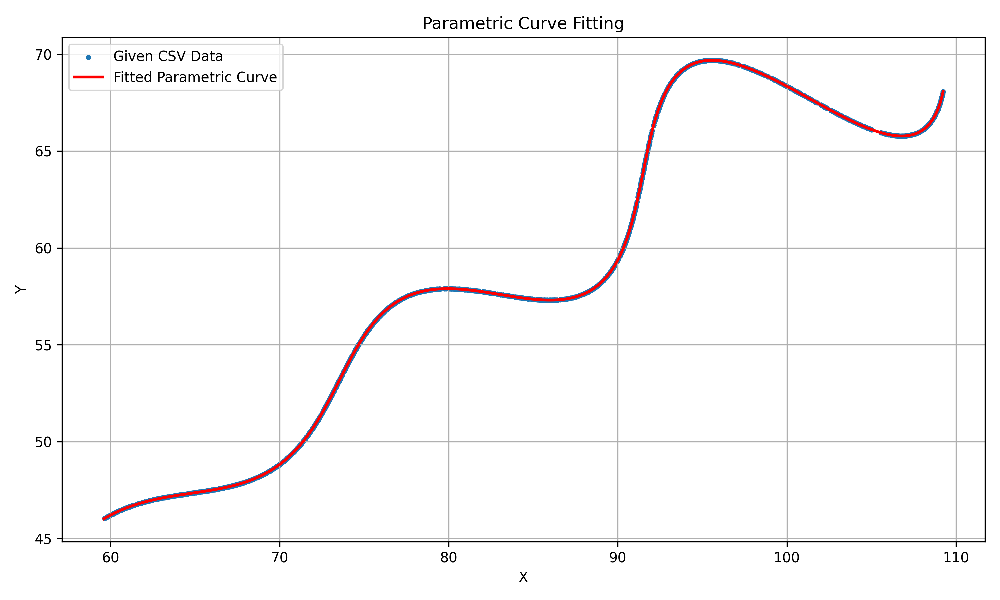

# R&D / AI Parametric Curve Assignment

# R&D / AI Parametric Curve Assignment

## 1. Problem Statement

The objective of this assignment is to find the unknown parameters **theta (θ), M, and X** from a given set of points belonging to a parametric curve.

The parametric equations are:

x = t*cos(theta) - exp(M*|t|)*sin(0.3t)*sin(theta) + X

y = 42 + t*sin(theta) + exp(M*|t|)*sin(0.3t)*cos(theta)

The parameter ranges are:

- 0 < theta < 50 degrees
- -0.05 < M < 0.05
- 0 < X < 100
- 6 < t < 60

The goal is to determine the values of **theta**, **M**, and **X** that make the generated parametric curve closely match the given data points.

---

## 2. Dataset

The provided `xy_data.csv` file contains the points that lie on the required curve.

The CSV file contains two columns:

- `x` - X-coordinate of the data point
- `y` - Y-coordinate of the data point

The dataset is loaded using Pandas.

The program uses the location of `solve.py` to locate the CSV file:

```python
BASE_DIR = Path(__file__).resolve().parent
csv_path = BASE_DIR / "xy_data.csv"

data = pd.read_csv(csv_path)

3. Approach

The following steps are used:

Load the CSV data using Pandas.
Extract the x and y coordinates.
Combine the coordinates into (x, y) points.
Generate points from the given parametric equations.
Compare the generated curve with the given data points.
Calculate the nearest-point L1 distance.
Use numerical optimization to find the values of theta, M, and X that minimize the L1 distance.
Generate the final fitted curve using the optimized parameters.
Plot the original data points and the fitted curve.
Save the generated plot as fitted_curve.png.

## 4. Optimization

The `differential_evolution` optimization method from SciPy was used.

The search was performed within the parameter ranges specified
in the assignment.

The objective function minimizes the mean L1 distance between
the supplied data points and the generated parametric curve.

## 5. Results

The estimated parameters are:

theta = 30 degrees

M = 0.03

X = 55

The optimization produced an L1 error of approximately:

0.0040733

## 6. Final Parametric Equation

Using the estimated parameters:

x = t*cos(30°) - exp(0.03*|t|)*sin(0.3t)*sin(30°) + 55

y = 42 + t*sin(30°) + exp(0.03*|t|)*sin(0.3t)*cos(30°)

where:

6 < t < 60

## 7. Result Visualization

The generated plot compares the points from `xy_data.csv`
with the fitted parametric curve.



## 8. Files

- `xy_data.csv` - Input dataset
- `solve.py` - Python implementation
- `fitted_curve.png` - Generated fitted curve
- `README.md` - Project documentation

## 10. How to Run

Install the required dependencies:

pip install -r requirements.txt

Run the program:

python solve.py

The program will optimize the parameters, display the results, generate the fitted curve, and save it as fitted_curve.png.

## 11. Conclusion

The unknown parameters of the given parametric curve were estimated using numerical optimization.

The final estimated values are:

Theta = 30°
M     = 0.03
X     = 55

The fitted curve closely matches the points provided in the dataset, with an approximate L1 error of 0.0040733.